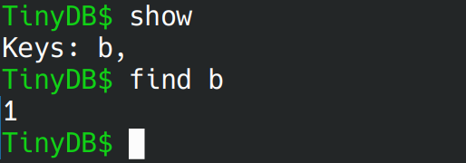

# TinyDB使用说明
TinyDB是使用socket实现的简单键值对存储服务。

下面将介绍使用方法。

# 编译
系统环境：linux

编译器：clang++

c++版本：c++11

进入src目录后，直接使用make命令编译即可

```shell
cd src
make
```

编译之后可以在目录下看到myserver和myclient

# 运行

在两个终端里分别运行myserver和myclient

## 服务端

TinyDB通过客户端向服务端发送指令来实现控制，因此服务端只要启动即可，无需进行多于的操作

## 客户端

启动客户端之后，可以看到一个CLI，TinyDB提供的CLI支持help, insert, find, delete, show, quit, shutdown几个命令。


他们的作用如下：
### help

作用：打印帮助信息。输入help之后打印出了可以使用的命令以及用法。


### insert \<key\> \<value\>

作用：插入键值对，需要两个参数，第一个是键，第二个是值，中间用空格隔开。如果插入成功，命令行中会打印“Insert Success”，如果该键已经存在，则会爆出错误。


### delete \<key\> 

作用：删除一个键值对。需要传入一个参数——键。如果删除成功会打印“Delete Success”，如果待删除的键值对不存在则报错。


### find \<key\>

作用：获取一个键值对的值。需要传入一个参数。如果查询成功则会直接打印出值，若该键值对不存在则会打印Null。



### show

作用：展示服务端存储的所有记录的键。如果服务端保存了记录则会打印出每一个记录的键，以逗号为分隔。如果服务端没有保存任何记录则会打印Empty。


### save

作用： 让服务端保存所有的键值对到文件tinydb.bin中。保存之后，下一次重启服务端，服务端会自动从文件tinydb.bin中重新载入所有的键值对。


执行了以上指令之后，tinydb.bin中存储的内容如下：


### quit

作用：关闭客户端CLI。


### shutdown

作用：关闭服务端和客户端。


